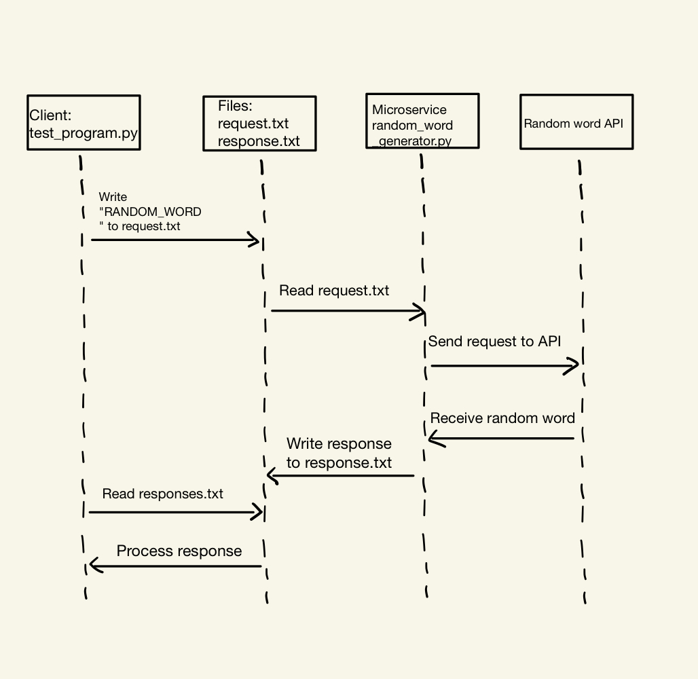

# Random Word Generator Microservice

## Overview

This microservice generates a random word of length 5 and writes it to a response 
file on request. The service monitors a request file for requests and handles them
as they come.

## Communication Contract


### Running the Microservice

First, you need to run the `random_word_generator.py` script to start the microservice.

```
python3 random_word_generator.py
```

### Running the Test

Next, you will run the `test_program.py` script to obtain results.

```
python3 test_program.py`
```

### A. Requesting Data
To request a random word, write RANDOM_WORD into request.txt.
```
with open('request.txt', 'w') as file:
    file.write("RANDOM_WORD")
```

### B. Receiving Data
To receive data from the microservice, read the contents of `response.txt` after 
the request has been processed.
```
def read_response():
    with open('response.txt', 'r') as file:
        response = file.read().strip()
    return response
```

### C. UML Sequence Diagram
